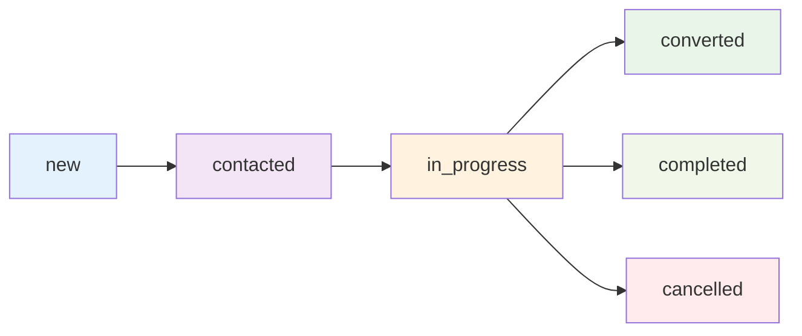

# Lead Management System: Status-Based Implementation

## 🎯 **Strategic Change: From Deletion to Status Management**

### **Previous Approach (Problematic):**
- ❌ **Delete lead records** after conversion
- ❌ **Lose historical data** and audit trail
- ❌ **No conversion analytics** possible
- ❌ **No recovery mechanism** if issues occur

### **New Approach (Business-Friendly):**
- ✅ **Change lead status** to 'converted'
- ✅ **Preserve all historical data** for analytics
- ✅ **Complete audit trail** of lead journey
- ✅ **Business intelligence** capabilities
- ✅ **Recovery and reporting** features

## 📊 **Lead Status Lifecycle**



## 🔄 **Updated Lead Conversion Process**

### **Step 1: Project Creation**
```typescript
// Creates new project record
const project = await createProject({
  customer_id: lead.customer_id,
  project_name: `${lead.service_type} - ${lead.name}`,
  project_type: lead.service_type,
  priority: lead.urgency_level,
  project_value: lead.estimated_value,
  notes: `Converted from lead ${lead.id} on ${new Date()}`
})
```

### **Step 2: Lead Status Update**
```sql
-- Instead of: DELETE FROM consultation_requests WHERE id = 'lead-123'
UPDATE consultation_requests 
SET 
  status = 'converted',
  converted_to_project_id = 'project-456',
  converted_at = NOW(),
  updated_at = NOW()
WHERE id = 'lead-123';
```

## 🎛️ **Dashboard Lead Filtering**

### **Filter Options:**
1. **Active** - Shows new, contacted, in_progress leads (default)
2. **Converted** - Shows leads converted to projects
3. **Completed** - Shows completed leads
4. **Cancelled** - Shows cancelled leads
5. **All** - Shows all leads regardless of status

### **Lead Counts:**
- **Active Leads**: Available for conversion and work
- **Converted Leads**: Successfully converted to projects
- **Total Leads**: Complete lead pipeline

## 📈 **Business Intelligence Benefits**

### **Conversion Analytics:**
```sql
-- Conversion rate analysis
SELECT 
  COUNT(CASE WHEN status = 'converted' THEN 1 END) as converted_count,
  COUNT(*) as total_leads,
  ROUND(
    COUNT(CASE WHEN status = 'converted' THEN 1 END) * 100.0 / COUNT(*), 
    2
  ) as conversion_rate_percent
FROM consultation_requests;

-- Monthly conversion trends
SELECT 
  DATE_TRUNC('month', converted_at) as month,
  COUNT(*) as conversions,
  AVG(project_value) as avg_project_value
FROM consultation_requests cr
JOIN projects p ON cr.converted_to_project_id = p.id
WHERE status = 'converted'
GROUP BY month
ORDER BY month;
```

### **Lead Journey Analysis:**
```sql
-- Lead lifecycle duration
SELECT 
  name,
  email,
  created_at as lead_created,
  converted_at as converted,
  (converted_at - created_at) as time_to_conversion
FROM consultation_requests 
WHERE status = 'converted'
ORDER BY time_to_conversion;
```

## 🛢️ **Database Schema Changes**

### **New Columns Added:**
```sql
-- Conversion tracking
converted_to_project_id UUID REFERENCES projects(id)
converted_at TIMESTAMP

-- Status constraint updated
CHECK (status IN ('new', 'contacted', 'in_progress', 'completed', 'cancelled', 'converted'))
```

### **Performance Indexes:**
```sql
-- Status filtering
CREATE INDEX idx_consultation_requests_status ON consultation_requests(status);

-- Conversion tracking
CREATE INDEX idx_consultation_requests_converted 
ON consultation_requests(converted_to_project_id) 
WHERE converted_to_project_id IS NOT NULL;
```

### **Convenience Views:**
```sql
-- Active leads for daily operations
CREATE VIEW active_leads AS
SELECT * FROM consultation_requests 
WHERE status IN ('new', 'contacted', 'in_progress');

-- Converted leads with project details
CREATE VIEW converted_leads_with_projects AS
SELECT 
  cr.*,
  p.project_number,
  p.project_name,
  p.project_value,
  p.status as project_status
FROM consultation_requests cr
JOIN projects p ON cr.converted_to_project_id = p.id
WHERE cr.status = 'converted';
```

## 🔧 **Implementation Summary**

### **Files Modified:**
1. **`UnifiedLeadsList.tsx`** - Updated conversion logic and filtering
2. **`DashboardStats.tsx`** - Added converted leads tracking
3. **`consultation-requests/route.ts`** - Updated API filtering
4. **`consultation-requests.service.ts`** - Enhanced filter options
5. **`types.ts`** - Added new filter types
6. **`add-converted-status.sql`** - Complete database migration

### **Key Changes:**
- ✅ **Conversion method**: Status update instead of deletion
- ✅ **Lead filtering**: Status-based filtering in UI
- ✅ **Dashboard tracking**: Separate active vs converted counts
- ✅ **Data preservation**: Complete audit trail maintained
- ✅ **Business intelligence**: Analytics and reporting capabilities

## 🚀 **Implementation Steps**

### **Step 1: Run SQL Migration**
Execute the updated `add-converted-status.sql` in your Supabase dashboard.

### **Step 2: Test Lead Conversion**
1. Convert a lead to project
2. Verify lead status changes to 'converted'
3. Check lead appears in "Converted" filter
4. Verify dashboard counts update correctly

### **Step 3: Verify Filtering**
1. Switch between Active/Converted/All filters
2. Verify correct leads appear in each view
3. Check dashboard stats show proper counts

## 📊 **Expected Behavior**

### **Before Conversion:**
- **Active Leads**: 25
- **Converted Leads**: 5
- **Total Projects**: 12

### **After Converting 1 Lead:**
- **Active Leads**: 24 (decreased by 1)
- **Converted Leads**: 6 (increased by 1)
- **Total Projects**: 13 (increased by 1)

### **Lead Status Journey:**
```
Lead ID: 123
Status: new → contacted → in_progress → converted
Projects: None → None → None → Project #456
Visibility: Active list → Active list → Active list → Converted list
```

## 🎯 **Business Value**

1. **Data Integrity**: No data loss, complete audit trail
2. **Analytics**: Conversion rates, lead quality analysis
3. **Compliance**: Full record keeping for business purposes
4. **Recovery**: Can track and recover conversion history
5. **Intelligence**: Lead source effectiveness, timing analysis
6. **Forecasting**: Conversion pipeline and trend analysis

This implementation transforms the CRM from a simple lead tracker into a comprehensive business intelligence platform while maintaining data integrity and providing valuable insights for business growth.
